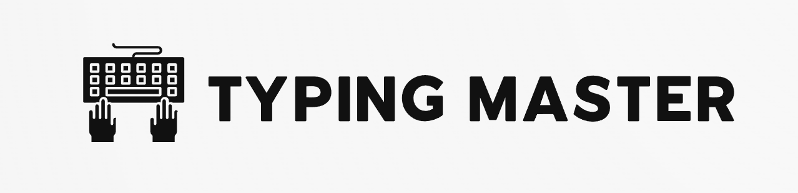

# Typing Master - Typing Speed Test 🚀
_A clean, interactive, and fun way to enhance your typing skills._

## About the Project
Typing Master is an engaging web-based application designed to help users improve their typing speed, accuracy, and efficiency. With its user-friendly interface and real-time feedback, it's the perfect platform for anyone from beginners to typing pros to practice and track progress.

## Key Features
- ✅ **Real-Time Feedback**: See your typing speed (WPM), accuracy, and errors as you type.
- ✅ **Dynamic Text Prompts**: A variety of sentences to keep the practice interesting and challenging.
- ✅ **Interactive UI**: Clean, modern design with color-coded feedback (green for correct, red for incorrect).
- ✅ **Performance Tracking**: Analyze errors and work on improving weak areas.
- ✅ **Responsive Design**: Works seamlessly on desktops, tablets, and mobile devices.

## Technologies Used
- **Frontend**: HTML, CSS, JavaScript
- **Fonts**: Google Fonts - _Sono_
- **Design**: Minimalistic with a focus on user experience.
# Screenshot :

